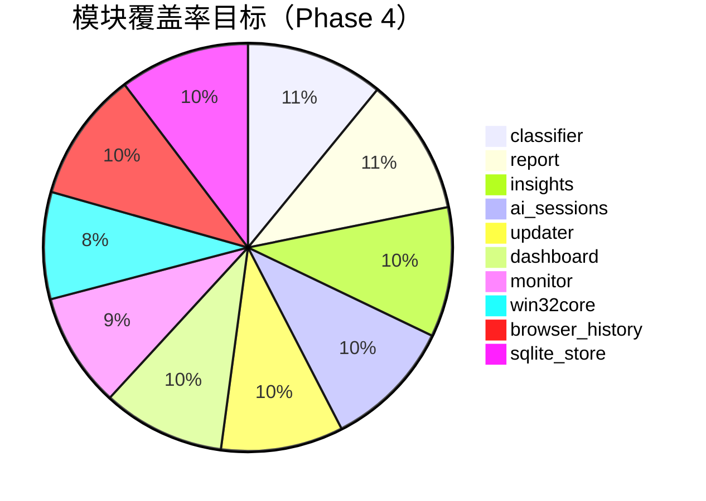
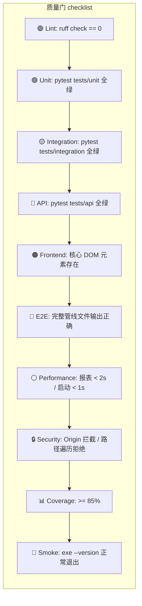

# VibeTrace 测试流程方案

> **文档版本**：v1.2 | **更新日期**：2026-08-23 | **状态**：双体系已合并（test_all.py 退役，pytest 483 项 + 全链路 E2E，覆盖率门禁 70% 实测 79%）

> **✅ 2026-08-23 合并完成**：`test_all.py` 的 47 个测试函数已机械整移为 `tests/` 四个主题模块（monitor 场景 / 报表内容 / 仪表盘 API 面 / 洞察生态）+ `tests/support/scenario.py` 共享支撑层；check/ok 断言调用数守恒（339 处零丢失）；CI 已删除 legacy 步骤；文件物理删除。详见 §3.1 末尾的完成说明。

## 一、现状与痛点

> 以下为**改造前基线**描述（2026-08-19 落地方案时的出发点）；当前实施现状：pytest 85 项分层测试 + CI fast/full + 覆盖率门禁 50% 均已上线，见本文档后续章节。

当前项目仅依赖单文件集成测试 `test_all.py`（48 个 `test_` 函数、334 项 `check`），通过猴子补丁模拟 `win32core` 与 `monitor` 完成全量覆盖。CI 仅在 tag push 时触发，无 PR 门禁、无分层、无前端测试、无性能基线。

| 维度 | 现状 | 目标 |
|------|------|------|
| 测试分层 | 单一集成文件 | 六层金字塔 |
| 覆盖率 | 有报告、无阈值 | `fail-under=85%` |
| CI 触发 | 仅 tag push | PR fast check + tag full build |
| 前端测试 | 无 | Dashboard API + 无头 smoke |
| 性能基线 | 无 | 报表生成 < 2s / 仪表盘启动 < 1s |
| 安全校验 | 无 | Origin / Referer 自动化断言 |

---

## 二、分层测试金字塔

```mermaid
flowchart TD
    subgraph 金字塔["测试金字塔（越上层越慢、越贵）"]
        E2E["🔴 E2E / Smoke<br>Playwright + exe --version"]
        Frontend["🟠 Frontend / API Contract<br>http.client + 无头浏览器"]
        Integration["🟡 Integration<br>pytest + 猴子补丁"]
        Unit["🟢 Unit<br>pytest + 纯函数/类"]
    end

    subgraph 横切
        Performance["⚪ Performance<br>timeit / pytest-benchmark"]
        Security["🔵 Security<br>Origin 校验 / 路径遍历"]
        Quality["🟣 Quality Gate<br>ruff + coverage + build"]
    end

    Unit --> Integration --> Frontend --> E2E
    Quality -.-> Unit
    Quality -.-> Integration
    Performance -.-> Integration
    Security -.-> Frontend
    Security -.-> E2E
```



### 2.1 各层职责与技术选型

| 层级 | 职责 | 技术选型 | 运行方式 | 预估耗时 |
|------|------|----------|----------|----------|
| **Unit** | 纯函数、配置解析、分类规则、数据校验 | `pytest` + `unittest.mock` | `python -m pytest tests/unit -q` | < 5s |
| **Integration** | 跨模块管线、猴子补丁模拟 Win32、SQLite 读写 | `pytest` + 现有猴子补丁模式 | `python -m pytest tests/integration -q` | < 30s |
| **API Contract** | Dashboard `/api/*` 路由、CORS、Origin/Referer 拦截 | `http.client` + `threading` | `python -m pytest tests/api -q` | < 10s |
| **Frontend** | PAGE_TEMPLATE 中 JS 函数、CSS 兼容性 | `playwright`（无头 Chromium） | `pytest tests/frontend` | < 60s |
| **E2E** | 完整用户流：启动 → 采集 → 生成报表 → 打开仪表盘 | `pytest` + `subprocess` + `playwright` | `pytest tests/e2e` | < 120s |
| **Performance** | 报表生成、仪表盘启动、大数据量聚合 | `timeit` / `pytest-benchmark` | `pytest tests/performance` | < 60s |
| **Security** | Origin 校验、路径遍历、SQL 注入、更新地址白名单 | 自定义断言 + `pytest` | `pytest tests/security` | < 10s |

> **原则**：不引入重型框架。`pytest` 为唯一测试运行器；`playwright` 仅用于无头浏览器场景；`http.client` 替代 `requests` 保持零第三方依赖。

---

## 三、目录结构提案

```
D:\VibeTrace（刻迹）
├── tests/
│   ├── conftest.py          # pytest 全局 fixtures：临时目录、mock_win32、mock_config
│   ├── __init__.py
│   ├── unit/                # 纯函数/类测试
│   │   ├── __init__.py
│   │   ├── test_classifier.py      # 分类规则、联系人识别、AI 工具匹配
│   │   ├── test_report.py          # 报表聚合、重分类、校验修复
│   │   ├── test_insights.py        # 离线规则引擎、AI 洞察过滤
│   │   ├── test_ai_sessions.py     # Token 估算、成本计算、模型定价
│   │   ├── test_updater.py         # 版本比较、下载地址白名单
│   │   ├── test_paths.py           # 路径解析、环境变量覆盖
│   │   └── test_inventory.py       # 软件清单扫描逻辑
│   ├── integration/         # 跨模块集成测试
│   │   ├── __init__.py
│   │   ├── test_monitor_cycle.py   # 前台窗口轮询、空闲截断、跨天轮转
│   │   ├── test_browser_history.py # Chromium/Firefox 历史解析管线
│   │   ├── test_sqlite_backend.py  # JSONL ↔ SQLite 一致性、回填、重建
│   │   ├── test_dashboard_api.py   # /api/overview /api/trends 等路由
│   │   └── test_git_insights.py    # 本地 Git 提交解析、代码产出率
│   ├── api/                 # API Contract 测试
│   │   ├── __init__.py
│   │   ├── test_origin_referer.py  # Origin / Referer 拦截策略
│   │   ├── test_cors_preflight.py  # OPTIONS、Access-Control-Allow-Origin
│   │   └── test_token_auth.py      # dashboard_token HMAC 校验
│   ├── frontend/            # 前端逻辑测试
│   │   ├── __init__.py
│   │   ├── test_js_functions.py    # PAGE_TEMPLATE 中关键 JS 函数（抽离到 .js 后）
│   │   └── test_dashboard_smoke.py # 仪表盘无头渲染、核心元素存在性
│   ├── e2e/                 # 端到端测试
│   │   ├── __init__.py
│   │   └── test_full_pipeline.py   # 启动 monitor → 等待采集 → 生成日报 → 断言文件存在
│   ├── performance/         # 性能基线测试
│   │   ├── __init__.py
│   │   ├── test_report_speed.py    # 日报生成 < 2s
│   │   ├── test_dashboard_startup.py # 仪表盘启动 < 1s
│   │   └── test_large_jsonl.py     # 10万条记录聚合内存/耗时
│   └── security/            # 安全测试
│       ├── __init__.py
│       ├── test_path_traversal.py  # 数据根目录外访问拦截
│       ├── test_update_whitelist.py # 非法下载地址拒绝
│       └── test_privacy_blacklist.py # 标题黑名单命中记 [已隐藏]
├── .github/
│   └── workflows/
│       ├── ci-fast.yml      # PR 触发：ruff + unit + integration + api
│       └── ci-full.yml      # tag push：full + build + smoke + E2E
├── docs/
│   └── TEST_WORKFLOW.md     # 本文档
└── pyproject.toml           # pytest / coverage / ruff 配置集中化
```

### 3.1 迁移路径（已完成——实际执行方式与原计划有差异）

> **完成记录（2026-08-23）**：最终未采用「逐函数改写 + pytest monkeypatch fixture」的原计划，
> 而是**机械整移**：按域切为 4 个主题文件，助手集中到 `tests/support/scenario.py`，
> `check()` 失败即 raise 本就兼容 pytest，无需改写断言。优点：零丢失、可对账、一次到位；
> 唯一实质改动是 `_chrome_ft` 改正午锚定（消除午夜抖动类 flaky）。原四阶段计划保留如下存档。

```mermaid
flowchart LR
    subgraph Phase1["Phase 1：基础设施（1-2 周）"]
        A1["创建 tests/ 目录结构"]
        A2["编写 conftest.py<br>通用 fixtures"]
        A3["pyproject.toml 配置<br>pytest + coverage"]
    end

    subgraph Phase2["Phase 2：迁移核心（2-3 周）"]
        B1["test_classifier 规则 → unit"]
        B2["test_monitor_cycle → integration"]
        B3["test_dashboard_api → api"]
    end

    subgraph Phase3["Phase 3：补齐短板（2-3 周）"]
        C1["frontend smoke"]
        C2["performance 基线"]
        C3["security 校验"]
    end

    subgraph Phase4["Phase 4：退役旧版（1 周）"]
        D1["CI 切到新测试"]
        D2["test_all.py 标记 legacy"]
        D3["覆盖率门禁 85%"]
    end

    Phase1 --> Phase2 --> Phase3 --> Phase4
```



**详细步骤**：

1. **Phase 1（基础设施）**
   - 创建 `tests/` 目录及子目录
   - 编写 `tests/conftest.py`，将 `test_all.py` 中 `FG` / `P` 模拟类、`fresh_tmp`、`mock_win32` 提取为 pytest fixtures
   - 新建 `pyproject.toml`（或复用现有配置），集中 `pytest`、`coverage`、`ruff` 配置
   - `test_all.py` 保持不动，仅在其顶部添加注释：`# LEGACY: 逐步迁移至 tests/，详见 docs/TEST_WORKFLOW.md`

2. **Phase 2（核心迁移）**
   - 按模块将 `test_all.py` 中相关 `test_` 函数迁移到对应分层目录
   - 迁移时保持猴子补丁模式（与现有逻辑一致），但改用 `pytest` 的 `monkeypatch` fixture
   - 优先迁移纯函数类（`classifier`、`report`、`insights`）到 `tests/unit/`
   - 再迁移跨模块测试（`monitor` 轮询、`browser_history` 管线）到 `tests/integration/`

3. **Phase 3（补齐短板）**
   - `tests/frontend/`：使用 `playwright` 无头模式打开 `http://127.0.0.1:8765`，断言核心 DOM 元素存在
   - `tests/performance/`：使用 `time.perf_counter()` 包裹报表生成函数，断言耗时 < 阈值
   - `tests/security/`：构造非法 Origin、非法路径、非法下载地址，断言被拒绝

4. **Phase 4（退役旧版）✅**
   - ✅ CI 中 legacy 步骤删除，coverage 直接跑 pytest 分层 + e2e
   - ✅ `test_all.py` 物理删除（pyproject omit 同步清理）
   - 门禁维持 70%（实测 79%；85% 目标待后续提阈值）

---

## 四、覆盖率门禁策略

### 4.1 基线与目标

| 阶段 | 时间 | 阈值 | 说明 |
|------|------|------|------|
| 当前基线 | — | 无阈值 | 334 项 check 全绿，覆盖率未知 |
| Phase 1 ✅ 已落地 | 2026-08 | `fail-under=50%` | 85 项 pytest + CI fast/full 已上线，实测覆盖率 56% |
| Phase 2 | 第 3-5 周 | `fail-under=65%` | 核心模块迁移完成 |
| Phase 3 | 第 6-8 周 | `fail-under=75%` | 补齐前端/性能/安全测试 |
| Phase 4 | 第 9 周起 | `fail-under=85%` | 长期门禁，仅允许例外审批 |

### 4.2 模块级覆盖目标



> **豁免规则**：`win32core.py` 中直接调用 Win32 API 的函数（如 `get_foreground_window`）因需真实 Windows 环境，允许覆盖低于 70%，但需有集成测试通过猴子补丁覆盖调用路径。

### 4.3 覆盖率配置（`pyproject.toml`）

```toml
[tool.coverage.run]
source = [
    "monitor", "classifier", "report", "dashboard",
    "browser_history", "inventory", "win32core", "paths",
    "applog", "tray", "insights", "updater",
    "sqlite_store", "ai_sessions", "git_insights"
]
omit = [
    "test_all.py",
    "tests/*",
    "*/conftest.py"
]

[tool.coverage.report]
exclude_lines = [
    "pragma: no cover",
    "def __repr__",
    "raise AssertionError",
    "raise NotImplementedError",
    "if __name__ == .__main__.:",
    "if TYPE_CHECKING:"
]
fail_under = 85
show_missing = true
skip_covered = false
```

---

## 五、CI 矩阵

### 5.1 工作流拆分

```mermaid
flowchart TD
    subgraph PR["PR / Push to main（ci-fast.yml）"]
        F1["🟣 ruff check"]
        F2["🟢 pytest tests/unit"]
        F3["🟡 pytest tests/integration"]
        F4["🔵 pytest tests/api"]
        F5["⚪ pytest tests/security"]
    end

    subgraph Tag["Tag push v*（ci-full.yml）"]
        T1["全部 fast check"]
        T2["🟠 pytest tests/frontend"]
        T3["🔴 pytest tests/e2e"]
        T4["📊 coverage report --fail-under=85"]
        T5["🔨 PyInstaller build"]
        T6["💨 exe --version smoke"]
        T7["📦 Release"]
    end

    F1 --> F2 --> F3 --> F4 --> F5
    T1 --> T2 --> T3 --> T4 --> T5 --> T6 --> T7
```



### 5.2 ci-fast.yml（PR 触发）

```yaml
name: Fast Check

on:
  pull_request:
    branches: [main, master]
  push:
    branches: [main, master]

jobs:
  lint:
    runs-on: windows-latest
    steps:
      - uses: actions/checkout@v4
      - uses: actions/setup-python@v5
        with: { python-version: '3.11' }
      - run: pip install ruff
      - run: ruff check .

  test:
    runs-on: windows-latest
    needs: lint
    steps:
      - uses: actions/checkout@v4
      - uses: actions/setup-python@v5
        with: { python-version: '3.11' }
      - run: pip install coverage pytest
      - run: coverage run -m pytest tests/unit tests/integration tests/api tests/security -q
      - run: coverage report -m
```

### 5.3 ci-full.yml（Tag 触发，继承现有 build.yml）

```yaml
name: Full Build & Release

on:
  push:
    tags: ['v*']
  workflow_dispatch:

jobs:
  test:
    runs-on: windows-latest
    steps:
      - uses: actions/checkout@v4
      - uses: actions/setup-python@v5
        with: { python-version: '3.11' }
      - run: pip install coverage pytest playwright
      - run: playwright install chromium
      - run: coverage run -m pytest tests/ -q
      - run: coverage report -m --fail-under=85
      - run: coverage xml -o coverage.xml
      - uses: actions/upload-artifact@v4
        with: { name: coverage-report, path: coverage.xml }

  build:
    runs-on: windows-latest
    needs: test
    permissions: { contents: write }
    steps:
      - uses: actions/checkout@v4
      - uses: actions/setup-python@v5
        with: { python-version: '3.11' }
      - run: pip install pyinstaller
      - run: python -m PyInstaller VibeTrace.spec --noconfirm --distpath dist --workpath build
      - name: Smoke test
        run: .\dist\VibeTrace.exe --version
      - name: Assert version matches tag
        shell: pwsh
        run: |
          $version = (python -c "import version; print(version.VERSION)").Trim()
          if ($env:GITHUB_REF -match '^refs/tags/v(.+)$') { $expected = $Matches[1] }
          else { $expected = $version }
          if ($version -ne $expected) { Write-Error "Version mismatch"; exit 1 }
      - uses: actions/upload-artifact@v4
        with:
          name: VibeTrace-windows
          path: |
            dist/VibeTrace.exe
            dist/VibeTrace.exe.sha256
            installer.ps1
            uninstaller.ps1
      - if: startsWith(github.ref, 'refs/tags/')
        uses: softprops/action-gh-release@v2
        with:
          files: |
            dist/VibeTrace.exe
            dist/VibeTrace.exe.sha256
            installer.ps1
            uninstaller.ps1
          generate_release_notes: true
          overwrite_files: true
```

---

## 六、质量门（Quality Gates）



### 6.1 各质量门详细定义

| 质量门 | 检查项 | 失败行为 | 修复责任 |
|--------|--------|----------|----------|
| **Lint** | `ruff check .` 0 违规 | PR 阻塞 | 代码作者 |
| **Unit** | `pytest tests/unit` 100% 通过 | PR 阻塞 | 代码作者 |
| **Integration** | `pytest tests/integration` 100% 通过 | PR 阻塞 | 代码作者 |
| **API Contract** | `pytest tests/api` 100% 通过 | PR 阻塞 | 代码作者 |
| **Security** | `pytest tests/security` 100% 通过 | PR 阻塞 | 代码作者 |
| **Frontend** | 无头渲染仪表盘，断言 `#overview-chart` 存在 | Tag CI 阻塞 | 前端修改者 |
| **E2E** | 启动 monitor 30s → 生成日报 → 断言 Markdown 文件存在 | Tag CI 阻塞 | 管线修改者 |
| **Performance** | 10万条 JSONL 聚合 < 5s；日报生成 < 2s | Tag CI 警告（不阻塞） | 性能回归者 |
| **Coverage** | `coverage report --fail-under=85` | Tag CI 阻塞 | 测试补充者 |
| **Smoke** | `VibeTrace.exe --version` 退出码 0 | Tag CI 阻塞 | 构建维护者 |
| **Version** | `version.py` 与 tag 名一致 | Tag CI 阻塞 | 发布负责人 |

---

## 七、执行命令一览

### 7.1 开发日常

```powershell
# 代码风格检查（必须 0 违规）
ruff check .

# 单元测试（最快反馈）
python -m pytest tests/unit -q

# 集成测试（模拟 Win32）
python -m pytest tests/integration -q

# API 契约测试（启动 dashboard 线程）
python -m pytest tests/api -q

# 安全测试
python -m pytest tests/security -q

# 全量测试（本地完整验证）
python -m pytest tests/ -q

# 覆盖率报告（开发调试）
coverage run -m pytest tests/ -q
coverage report -m
coverage html
```

### 7.2 CI 专用

```powershell
# PR Fast Check
ruff check .
coverage run -m pytest tests/unit tests/integration tests/api tests/security -q
coverage report -m

# Tag Full Build
coverage run -m pytest tests/ -q
coverage report -m --fail-under=85
coverage xml -o coverage.xml

# PyInstaller 构建
python -m PyInstaller VibeTrace.spec --noconfirm --distpath dist --workpath build

# Smoke 测试
.\dist\VibeTrace.exe --version
```

### 7.3 性能基线

```powershell
# 报表生成速度
python -m pytest tests/performance/test_report_speed.py -v

# 仪表盘启动速度
python -m pytest tests/performance/test_dashboard_startup.py -v

# 大数据量聚合
python -m pytest tests/performance/test_large_jsonl.py -v
```

### 7.4 遗留兼容

```powershell
# 旧版单文件测试（仍可用，但不新增 case）
python test_all.py
```

---

## 八、关键设计决策

### 8.1 为什么不用 `unittest` 而用 `pytest`？

- `pytest` 兼容 `unittest` 语法，迁移成本低
- `pytest` 的 `fixture` 和 `monkeypatch` 比手动猴子补丁更简洁
- `pytest-benchmark` 和 `pytest-playwright` 插件生态成熟
- 社区标准，CI 和 IDE 支持更好

### 8.2 为什么前端测试用 `playwright` 而非 `selenium`？

- `playwright` 无头模式更稳定，Chromium 下载更快
- 内置自动等待，减少 flaky test
- 与 `pytest` 集成通过 `pytest-playwright` 插件，配置极简
- 项目已有 `playwright` 在 CI 中安装的经验（见 ci-full.yml）

### 8.3 为什么保留 `test_all.py`？

- 过渡期保险：新测试框架未完全覆盖前，`test_all.py` 作为兜底
- 历史兼容：贡献者可能习惯 `python test_all.py`
- 零风险：不删除、不修改，仅标记 `LEGACY`

### 8.4 为什么 `win32core` 允许低覆盖？

- `win32core.py` 直接调用 Win32 API（`ctypes`），无法在 Linux CI 上执行
- 其调用路径已通过 `tests/integration` 的猴子补丁覆盖
- 真实 Windows 行为由 E2E 和 Smoke 测试兜底

---

## 九、Roadmap 关联

本测试流程方案与项目 Roadmap 的对应关系：

| Roadmap 阶段 | 测试需求 | 对应本文档章节 |
|--------------|----------|----------------|
| Phase 1（会话级精细追踪） | `ai_sessions` 单元测试、Token 估算精度 | 3.1 Phase 2 |
| Phase 2（采纳率/留存率，需 IDE 插件） | 暂不涉及核心测试，插件独立仓库 | — |
| Phase 3（时间节省估算） | `report` 性能基线、成本计算正确性 | 2.1 Performance |
| Phase 4（自然语言查询） | Dashboard API 扩展、前端交互测试 | 2.1 Frontend / API |

---

## 十、附录：pyproject.toml 完整配置模板

```toml
[build-system]
requires = ["setuptools>=61.0"]
build-backend = "setuptools.build_meta"

[project]
name = "VibeTrace"
version = "0.0.0"  # 实际版本由 version.py 管理
description = "Windows 本地VibeTrace（刻迹）工具"
requires-python = ">=3.11"

[tool.pytest.ini_options]
testpaths = ["tests"]
python_files = ["test_*.py"]
python_classes = ["Test*"]
python_functions = ["test_*"]
addopts = "-q --tb=short"
markers = [
    "slow: marks tests as slow (deselect with '-m \"not slow\"')",
    "win32: marks tests that require real Win32 API",
    "e2e: marks end-to-end tests",
]

[tool.coverage.run]
source = [
    "monitor", "classifier", "report", "dashboard",
    "browser_history", "inventory", "win32core", "paths",
    "applog", "tray", "insights", "updater",
    "sqlite_store", "ai_sessions", "git_insights"
]
omit = [
    "test_all.py",
    "tests/*",
    "*/conftest.py"
]

[tool.coverage.report]
exclude_lines = [
    "pragma: no cover",
    "def __repr__",
    "raise AssertionError",
    "raise NotImplementedError",
    "if __name__ == .__main__.:",
    "if TYPE_CHECKING:"
]
fail_under = 85
show_missing = true
skip_covered = false

[tool.ruff]
line-length = 120
target-version = "py311"

[tool.ruff.lint]
select = ["E", "F", "W", "I", "N", "UP", "B", "C4", "SIM"]
ignore = ["E501"]

[tool.ruff.lint.pydocstyle]
convention = "google"
```

---

> **维护者注意**：本文档为设计提案，实施时需根据实际迁移进度更新章节状态。任何对 CI 工作流或测试目录结构的修改，应同步更新本文档。
