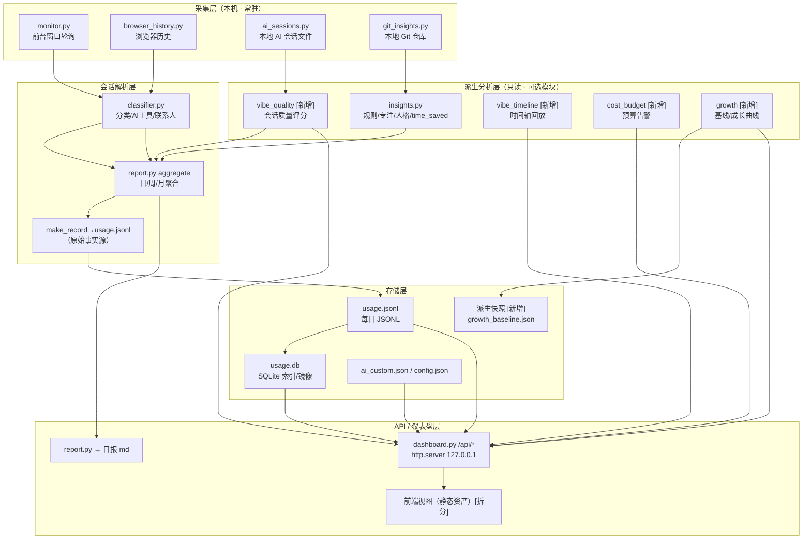

# VibeTrace 落地指导文档：本地优先的 Vibe Coding / AI 编程行为分析平台

> **文档版本**：v1.0 | **更新日期**：2026-08-20 | **目标版本**：2.4.0 → 3.0
> **文档性质**：落地指导（**只给方案，不实现代码**）。文中所引 `file:line` 均基于当前仓库（master / 提交 e62afba），描述的是**已存在的接口**；凡属"新增/提案"的接口均显式标注 `【新增】`，避免与现状混淆。
> **适用读者**：本仓库维护者 / 计算机专业同学（可连带理解背后原理）。

---

## 0. 一句话定位

把 VibeTrace 从"电脑使用情况监控（记录用了多久）"演进为 **"本地优先的 vibe coding / AI 编程行为分析平台（记录 AI 把时间花在哪、产出多少、值不值、有没有成长）"**——但**不引入任何第三方运行时依赖、不联网、不伪装精确**。

---

## 1. 当前基线（before）

> 所有路径相对仓库根 `D:\VibeTrace`。本节只陈述**现状事实**，改动点留到后续章节。

### 1.1 版本与发布

| 项 | 值 | 定位 |
|---|---|---|
| 当前版本 | `2.4.0` | `version.py:4` `VERSION = "2.4.0"`，发布时统一在此递增 |
| 上次 tag | `e62afba`（2026-08-18） | TODO.md 交接记录 |
| 里程碑 | v2.4.0 已完成待发布 | 测试金字塔 + 时间节省估算 + 前端修补 |

### 1.2 现有能力矩阵（已落地）

| 维度 | 能力 | 关键实现 |
|---|---|---|
| 前台窗口监控 | 5s 轮询、空闲 180s 截断、静止零写入 | `monitor.py:333 _open_session` / `monitor.py:223 make_record`；阈值见 `config.default.json` 顶层 `poll_interval_s` / `idle_threshold_s` |
| 分类 | 软件/社交/浏览器/AI 工具/终端工具 | `classifier.py:321 classify_category` / `classifier.py:427 detect_ai_tool` / `classifier.py:491 detect_term_tool` |
| 浏览器历史 | Chromium + Firefox URL 级、停留时长估算 | `browser_history.py:336 collect` / `browser_history.py:203 extract_visits` |
| AI 会话深度 | 对话轮次、Token、按模型/项目拆分、成本 | `ai_sessions.py:716 collect`（ROADMAP Phase 1/3） |
| 智能洞察 | 规则、专注度、死循环、人格、时间节省 | `insights.py:405 rule_insights` / `insights.py:590 behavior_insights` / `insights.py:740 persona_insights` / `insights.py:687 time_saved_insights` |
| Git 代码变更 | 只读提交、增删行、churn、修改率 | `git_insights.py:198 git_insights` / `git_insights.py:153 analyze_repo` |
| 报表 | 日报/周报/月报 md + csv，SQLite 快速路径 | `report.py:171 aggregate` / `report.py:347 generate_report_md` / `report.py:795 aggregate_days` |
| 仪表盘 | 本地 Web、10 视图、`/api/*` 路由 | `dashboard.py:2635 do_GET` / `dashboard.py:3063 do_POST` |
| 存储 | 每日 JSONL（事实源）+ 可选 SQLite 镜像 | `sqlite_store.py:76 init_db`（schema 见 `sqlite_store.py:34 _SCHEMA`） |

### 1.3 数据源

| 数据源 | 位置 | 说明 |
|---|---|---|
| 前台会话记录 | `<data_root>/YYYY-MM-DD/usage.jsonl` | **原始事实源**，每条含 start/end/duration_ms/exe/app/title/category/contact/ai_tool 等（`sqlite_store.py:97 _row_from_record` 可见完整字段） |
| SQLite 镜像 | `<data_root>/usage.db` | `sessions` 表，best-effort 同步，失败静默降级（`sqlite_store.py:137 append_record`） |
| AI 本地会话文件 | `ai_sessions` 配置路径 | `ai_sessions.py:258 _config_paths` / `ai_sessions.py:249 _default_tool_paths` |
| 浏览器历史 | Chromium/Firefox DB | `browser_history.py:59 find_history_dbs` |
| Git 仓库 | `insights.git.projects` | 只读，`git_insights.py:39 git_config` |
| 配置文件 | `config.json`（无则 `config.default.json`） | 热重载在 monitor 每轮生效，`data_root` 保持启动值 |
| 别名表 | `<data_root>/aliases.json` | 不入库 |

### 1.4 测试基线（pytest 85 项 + 旧 test_all 兼容）

> **⚠️ 快照已过期（2026-08-23 更新）**：下表为早期基线。当前实际：**59 个测试文件 / 483 项用例**
> （含全链路 E2E 七阶段），`test_all.py` 已整体并入 pytest 并退役，覆盖率门禁 70% 实测 79%。

| 层 | 目录 | 现有文件（test 函数数） |
|---|---|---|
| Unit | `tests/unit/` | test_ai_sessions(9), test_classifier(9), test_classifier_extended(7), test_insights_extra(7), test_paths(3), test_report(3), test_sqlite_extra(4), test_time_saved(5), test_updater(7) = **54** |
| Integration | `tests/integration/` | test_browser_history_pipeline(4), test_git_insights(5), test_monitor_cycle(3) = **12** |
| API | `tests/api/` | test_dashboard_contract(4), test_dashboard_extra(4) = **8** |
| Security | `tests/security/` | test_origin(3), test_privacy(5) = **8** |
| Performance | `tests/performance/` | test_report_speed(3) = **3** |
| Frontend | `tests/frontend/` | **空**（仅 `__init__.py`） |
| E2E | `tests/e2e/` | **空**（仅 `__init__.py`） |

- 合计 `pytest tests/ -q` = **85 项全过**；`python test_all.py` = **334 项 check**（LEGACY 兼容兜底）(README.md「Running tests」)
- 覆盖率门禁：`pyproject.toml` `fail_under = 50`，实测 pytest 口径 ~56%（TEST_WORKFLOW.md §4.1）
- CI：`.github/workflows/ci-fast.yml`（PR：ruff+unit+integration+api+security）+ 全量构建在 tag 触发

### 1.5 常用命令（可复制）

```powershell
# 测试
python -m pytest tests/ -q                     # 483 项全过（test_all.py 已并入并退役）
python -m pytest tests/unit -q                 # 最快反馈
ruff check .                                   # 0 违规

# 覆盖率（注意：pyproject 默认 addopts=-q，再传 -q 会变 -qq 吞掉 "N passed"）
coverage run -m pytest tests/ -q
coverage report -m
coverage html

# 手动跑某模块
python ai_sessions.py --day 2026-08-20 --web --json
python git_insights.py --day 2026-08-20 --json
python report.py --day 2026-08-20
python dashboard.py --open
python sqlite_store.py --status
```

> ⚠️ Windows 临时目录权限异常时，先清理 `%TEMP%\usagemon_hist_*` / `dsh-*` 再跑测试（README.md）。

### 1.6 当前限制（务必承认，不要假装解决）

| # | 限制 | 本质 |
|---|---|---|
| 1 | AI 会话解析是 **best-effort** | 第三方工具会话格式差异大，`ai_sessions.py:682 parse_file` 只读本地文件、格式不匹配会漏统计（TODO.md「未做 2」） |
| 2 | 采纳率/留存率**无法精确**（需 IDE 插件事件） | ROADMAP Phase 2 明确标注"需 IDE 插件支持"，当前只有耗时/产出，没有"某次 AI 建议是否被接受"事件 |
| 3 | 管理员权限窗口标题读不到 | 普通权限下标题为空，需 `monitor.py --admin` 提权（TODO.md「已知限制」） |
| 4 | Firefox 停留时长是估算 | 相邻访问间隔 + 上限 `firefox_dwell_max_s`（600s） |
| 5 | Token/成本是**估算** | `estimate_tokens`（CJK 1 Token/字，其余 4 字符/Token，`ai_sessions.py:425`）+ 内置定价表，非真实用量 |
| 6 | 时间节省是**粗估** | `time_saved` 用 AI 时长 × 固定因子 2.0，`insights.py:687` 明确写"仅作参考" |
| 7 | 覆盖门禁偏高但模块不均 | `fail_under=50`，win32core/dashboard 低覆盖靠集成测试补 |

---

## 2. 产品定位、非目标与工程约束

### 2.1 产品定位

一句话：**用你已有的本地监控数据，回答"AI 编程到底值不值、在哪个项目上、有没有在进步"，全程不下本机。**

三级价值主张：
1. **投入（计账）**：时间、Token、成本、产出——已基本具备。
2. **质量（看价值）**：AI 会话质量评分、Git 产出、专注度——v2.5 重点。
3. **成长（看趋势）**：能力基线、成长曲线、跨工具/跨项目对比——v2.6 重点。

### 2.2 非目标（未来也不做）

| 非目标 | 理由 |
|---|---|
| 云端同步 / 多设备 / 多人协作 | 违背本地优先、隐私默认 |
| 键盘输入 / 聊天内容 / 截屏 / 录屏 | 隐私红线，`_title_blacklist` 已有密码类过滤先例 |
| 付费功能 / 商业 SaaS | 开源 MIT |
| 精确的采纳率/留存率 | 无插件事件源，物理上做不到精确，只做"近似归因"（v3.0 spike） |
| 引入重型运行时（psutil/pywin32/requests/embedding 模型） | 破坏"零第三方运行时依赖"卖点 |
| 自然语言自由问答（LLM 理解任意问题） | 无本地模型、不联网，改做"受限模板查询"（v3.0） |
| 跨平台 | 面向 Windows + Win32（ctypes） |

> 决策原则：**ROADMAP FAQ 已定调**——所有新功能都是**可选模块**，可在 config 里关闭；核心"零依赖、本地优先"不变。

### 2.3 工程约束（写代码前对表，参考 Karpathy 编码四原则）

1. **零新增第三方运行时依赖**：只用 `python 标准库`（`sqlite3`/`json`/`http.server`/`argparse`/`datetime`…）。`pytest`/`coverage`/`ruff`/`playwright` 只在**开发/测试**侧，绝不进运行时 import。
2. **本地优先、隐私默认**：所有数据留在 `data_root`；仪表盘只监听 `127.0.0.1`；新增任何联网动作都要走 `config` 默认关闭 + 白名单。
3. **best-effort 不伪装精确**：估算值必须带 `label`/`notice`/`仅参考` 标注（沿用 `time_saved` 的成熟做法，`insights.py:687-727`）；做不到精确的指标明确声明误差范围。
4. **增量兼容**：新功能不得破坏既有 JSONL 读取与旧 config；新配置字段要有默认值；SQLite 是"镜像"不是"事实源"。
5. **避免过度工程**：能复用 `report.aggregate` / `ai_sessions.collect` / `insights.*` 就复用，不新造轮子；每个 PR 只解决一个主题。
6. **失败静默降级**：任何分析模块异常不得拖垮监控/仪表盘（现有 `/api/*` 全部 try/except 返回 500 而非崩溃，是标准做法）。

---

## 3. 总体架构图（Mermaid · 目标态）



层级职责一句话：

- **采集层**：只负责"如实记录发生了什么"（谁在前台、哪个 AI 工具、哪段会话、哪个 git commit）。
- **会话解析层**：把原始记录归一成可聚合的结构（`report.aggregate` 的输出）。
- **派生分析层**：在解析结果之上做**可选**打分/回放/预算/成长，全部只读、失败降级。
- **存储层**：JSONL 是事实源，SQLite 是镜像，派生快照是最新的缓存。
- **API/仪表盘层**：把派生结果给 UI，且全部走 `127.0.0.1` + Origin/Referer 校验 + 可选 token。

---

## 4. v2.5 详细落地

> v2.5 主题：**从"记了多久"到"AI 在做什么、做得好不好"**。三个提交独立可交付。

### 4.1 功能 A：AI 会话质量评分

**目标**：给每次会话、每个模型、每天一个 0–100 的"AI 协作质量分"，并给出分档 label。这是 v2.6 成长曲线与 v3.0 归因的基础输入。

**输入**（全部复用现状）：
- `ai_sessions.collect()` 的 `conversations`（`id/tool/model/project/turns/rounds/user_messages/assistant_messages/tokens_*/cost_*`，见 `ai_sessions.py:892 _conversation_summary` 返回结构）
- 每个会话 `generated_lines` / `generated_chars`（已在 tool stats 里累计，`_empty_tool_stats` `ai_sessions.py:852`）
- 同项目 Git 指标（可选）：`git_insights` 的 `modify_ratio` / `lines_added`

**输出数据结构【新增】 `quality.py` 或并入 `insights.py`**：

```jsonc
// 每个会话追加 quality 字段（沿用 conversation 结构，向后兼容）
{
  "quality_score": 73,            // 0-100 整数
  "quality_grade": "良",          // 优/良/中/待优化
  "quality_factors": {            // 子因子 0-1，便于解释"为什么是这个分"
    "efficiency": 0.8,            // 生成量/Token 的性价比
    "roundness": 0.7,             // 轮次效率
    "iteration": 0.9              // 生成->产出转化（结合 git 可选）
  },
  "quality_notice": "仅基于本地会话估算，非采纳率"   // 透明声明
}
```

**算法步骤**：
1. 对交易会话，计算 `token_efficiency = generated_chars / max(tokens_out,1)`（每输出 token 的生成字符数）。
2. 计算 `round_efficiency = rounds / max(user_messages,1)`（一轮 user→assistant 的完成度；`_count_rounds` `ai_sessions.py:585`）。
3. 若配置了 git 项目，把该会话归口项目的 `modify_ratio` 反转为"保留度"（`1 - modify_ratio`）；无 git 则该项取中性 0.5。
4. 加权合并为 0–1 分数：`efficiency*0.4 + roundness*0.3 + iteration*0.3`，再 ×100 取整。
5. 分档：≥80 优 / ≥65 良 / ≥45 中 / 其余待优化。
6. **不持久化到 JSONL**（JSONL 保持原始事实），质量分作为派生结果在请求时计算；可选缓存到 SQLite 新表（见 §7）。

**涉及文件**：`ai_sessions.py`（追加 `quality` 计算 helper）、`insights.py`（或新 `quality.py`）、`dashboard.py` 一个只管渲染的新 `/api/quality`（或并入已有 `/api/insights`）。

**接口【新增】**：`quality_score(conversations, config) -> list[dict]`（纯函数，天然可单测）；`/api/quality?date=` 返回当日按会话/按模型/按项目的质量分布。

**配置【新增】**：`config.default.json → ai_sessions.quality.enabled(true)`、`weights{efficiency,roundness,iteration}`、`grade_thresholds`。

**测试**（`tests/unit/test_quality.py`【新增】）：
- 空会话 → 0 分/中档、无 git 中性 0.5；
- 高生成量低 token → 分数高；
- 权重边界：全 0 与全 1 输入；
- 单测直接 import 纯函数，不依赖 Win32。

**验收标准**：`pytest tests/unit/test_quality.py` 全绿；对 `demo_data/` 跑一遍能产出 0–100 且 label 合理；`/api/quality` 无数据时返回可展示空态而非 500。

**预计工作量**：0.5–1 天（纯函数 + 一个只读端点）。

**回滚方案**：质量分是**纯派生、不落 JSONL**，回滚只删 `/api/quality` 路由与 `quality.py` 即可，历史数据零影响。

---

### 4.2 功能 B：Vibe Coding 时间轴回放

**目标**：把某一天"什么时间在哪个 AI 工具/哪个项目上干活、花了多少 token/钱、产生了多少行、何时提交"还原成一条可回放的可视化时间轴。本质是**把分散的时间戳对齐成叙事**。

**输入**（全部已存在）：
- `report.aggregate()` → `sessions`（`start`/`end`/`app`/`ai_tool`/`category`）
- `ai_sessions.collect()` → 每个 conversation 的 `first`/`last`（`_conversation_summary` 已计算 `first`/`last` 时间戳）
- `git_insights` → 每个 commit 的 `date`/`hash`/`added`/`deleted`（`git_insights.py:153 analyze_repo`）

**输出数据结构【新增】 `vibe_timeline.py`**：

```jsonc
{
  "date": "2026-08-20",
  "events": [
    { "t_start": "09:12:00", "t_end": "09:47:00", "kind": "ai_session",
      "tool": "opencode", "project": "VibeTrace", "model": "deepseek-v4-pro",
      "tokens_total": 12000, "cost_total": 0.31, "generated_lines": 180,
      "quality": 82 },
    { "t_start": "09:48:30", "kind": "git_commit", "hash": "ab12…",
      "project": "VibeTrace", "added": 150, "deleted": 20, "modify_ratio": 0.12 },
    { "t_start": "10:02:00", "kind": "ai_session", "tool": "chatgpt", "project": "未识别" }
  ],
  "summary": { "ai_minutes": 95, "commit_count": 3, "churn": 520, "total_cost": 0.9 }
}
```

**算法步骤**：
1. 取当日 `sessions`，仅保留 `category==AI编程` 或 `ai_tool` 非空的段。
2. 对同工具、时间相邻（间隔 < 阈值，默认如 120s）的多段会话做**合并**，得到粗粒度"AI 工作块"。
3. 用 `ai_sessions.conversations` 的 `first/last` 把 token/成本/生成量**叠加回**对应时间段；时间戳相近的会话归到该块。
4. 把 git commits 按 `date` 插入成 `git_commit` 事件。
5. 按 `t_start` 升序排序，输出 `events` + 摘要。
6. 全部内存计算，**不落盘**（每次请求重算，日期范围小）。

**涉及文件**：【新增】`vibe_timeline.py`（纯函数）+ `dashboard.py` 新端点 `/api/timeline` + 前端一个"时间轴"视图（静态 JS）。

**接口【新增】**：`build_timeline(date, data_root, config) -> dict`；`/api/timeline?date=`（可加 `project=` 过滤）。

**配置【新增】**：`vibe_timeline.enabled(true)`、`merge_gap_s(120)`。

**测试**（`tests/unit/test_vibe_timeline.py`【新增】）：
- 无 AI 会话 → events 空、summary 归零；
- 相邻段合并、间隔超阈值不合并；
- 时间戳乱序输入 → 输出仍有序；
- 空/坏 date → 返回空态。

**验收标准**：构造 3 条语法记录 + 2 个 commit + 1 段会话，时间轴能还原且时间递增；空数据返回 200 空态；`demo_data/` 可回放。

**预计工作量**：1–1.5 天（纯函数 + 一个视图）。

**回滚方案**：`vibe_timeline.py` 是独立新模块，删除文件+去掉路由即可，其余零影响。

---

### 4.3 功能 C：dashboard 拆分第一步

**目标**：`dashboard.py` 目前单文件 166KB（`Header` 类 + 全部路由 + `PAGE_TEMPLATE`），可维护性差。**第一步**只做"低风险、高收益"的拆分，不重构行为。

**拆分对象（第一步）**：
1. **前端模板外置**：把 `PAGE_TEMPLATE`（含全部页面 JS/CSS）从 `dashboard.py` 抽成 `assets/dashboard.html`，`do_GET` 在 `path in ("/", "/index.html")`（`dashboard.py:2652`）时读文件服务。HTML 里的 `DATA_ROOT`/`AUTH_FLAG` 占位替换逻辑保持不变（`dashboard.py:2653-2655`）。
2. **纯操作 helper 外置**：把与 HTTP 无关的纯函数（`_agg_to_csv` `dashboard.py:271`、`_backup_zip` `dashboard.py:295`、`_safe_extract_zip` `dashboard.py:329`、`_available_days` `dashboard.py:3320`、`_collect_known_apps` `dashboard.py:3331`）移到 `dashboard_util.py`【新增】，`dashboard.py` 改为 import。**不搬** `Handler` / 路由 / 鉴权（那部分风险高，留给 v3.0）。

**为什么先这样拆**：纯函数与静态资源是"零行为风险"的两类，可被 API 测试完全覆盖；把 `Handler`/鉴权留在原地，避免动到安全关键路径。

**输出**：`dashboard.py` 体积下降约 30–40%，新增 `dashboard_util.py` 与 `assets/dashboard.html`。

**接口**：现有 `/api/*` **契约不变**（这是本提交最重要验收）。

**测试**（`tests/api/test_dashboard_contract.py` 扩展，`tests/unit/test_dashboard_util.py`【新增】）：
- 对 `_agg_to_csv`/`_backup_zip`/`_available_days`/`_collect_known_apps` 逐一定单测；
- 现有 contract 测试逐条重跑（`/api/day` `/api/weeks` `/api/ai-sessions` …），确认响应 key 与之前逐字段一致；
- 首页 HTML 仍含 `DATA_ROOT` 占位且能被替换。

**验收标准**：`pytest tests/api tests/unit/test_dashboard_util.py` 全绿；`python dashboard.py --open` 十个视图肉眼可用；`ruff check .` 0 违规；`python test_all.py` 仍过（旧兜底）。

**预计工作量**：1–1.5 天。

**回滚方案**：本提交是"搬代码 + 外置静态资源"，纯重构。出问题直接 `git revert` 该 PR；或把 `assets/dashboard.html` 保留旧内联模板为 fallback（读不到文件回退 `PAGE_TEMPLATE`）。

---

## 5. v2.6 详细落地

> v2.6 主题：**把数据变成"决策"**——预算、对比、成长；同时把测试/覆盖率补齐。

### 5.1 功能 A：成本预算告警

**目标**：给 AI 成本设"周/月预算"，超阈值时在仪表盘 + 日志 +（可选）托盘提示，防止"vibe coding 烧钱无感"。成本已有（`ai_sessions` 的 `cost_*` 字段 + 定价表），缺的是**记账与告警**层。

**输入**：`ai_sessions.collect()` 的 `total.cost_total`（每日成本）；`_pricing_table`/`_pricing_file`（`ai_sessions.py:476/467`，`ai_pricing.json` 优先）。

**输出数据结构【新增】**（派生，可缓存）：

```jsonc
{
  "period": "month", "currency": "USD",
  "budget": 20.0, "spent": 12.34, "remaining": 7.66,
  "ratio": 0.62, "status": "ok" | "warn" | "exceed",
  "by_tool": {"opencode": 6.1, "chatgpt": 3.2},
  "by_project": {"VibeTrace": 4.5, "other": 7.8},
  "trend": [ {"day": "08-18", "cost": 1.2}, ... ]
}
```

**算法步骤**：
1. 按 `period`（week/month）聚合 `cost_total` 每日累计，得到 `spent` 与 `by_tool`/`by_project`（复用 `_merge_dim` 思路，`ai_sessions.py:878`）。
2. 对照 `budget`：`ratio>=1` → `exceed`；`ratio>=0.8` → `warn`；否则 `ok`。
3. 阈值变化时（跨入新档位）写一条 `applog` 日志（`applog.py:37 configure` / `applog.py:66 get_logger`）；仪表盘轮询时读 `state` 展示。
4. 月度回滚：月初自动复位（`datetime` 判断当前月首日）。

**涉及文件**：【新增】`cost_budget.py`（纯聚合 + 状态机），`applog.py`（复用），`dashboard.py` 新端点，前端成本面板加进度条。

**接口【新增】**：`budget_status(date, data_root, config) -> dict`；`/api/cost-budget?date=&period=month`。

**配置【新增】**：`ai_sessions.costs.budget.enabled(false 默认)`、`budget{amount:20, currency:"USD", period:"month", warn_at:0.8}`。默认关闭（隐私/不打扰）。

**测试**（`tests/unit/test_cost_budget.py`【新增】）：
- 未开启 → 空态；
- 超预算 → `exceed`；0.9/超额边界 → `warn`；
- 月初复位；
- 空数据 → spent=0, ok。

**验收标准**：构造 3 天成本数据，周/月预算命中 `ok/warn/exceed` 三态正确；日志在档位切换时写入单条；`demo_data` 可跑。

**预计工作量**：1 天。

**回滚方案**：纯新增模块 + 默认关闭配置，`git revert` 或直接删模块/路由即可。

---

### 5.2 功能 B：多工具横向对比

**目标**：回答"opencode vs chatgpt vs claude，哪个性价比/产出/质量更好"。数据已按 `by_model`/`by_project`/`by_tool` 结构化（`ai_sessions.collect`），缺的是**归一化对比**维度。

**输入**：跨 N 天的 `ai_sessions.collect()` 结果（`tools`/`total.by_model`/`by_project`）。

**算法步骤（归一化）**：
1. 按工具/模型聚合：`{tool: {sessions, minutes, tokens, cost, generated_chars, quality_avg}}`。
2. 派生**对比指标**（都带 `仅参考` 标注）：
   - `cost_per_1k_tokens`、`chars_per_$`（产出性价比）；
   - `chars_per_session`、`quality_avg`；
   - `share_pct`（成本占比 vs 会话占比）。
3. 输出对比表，前端用柱状图/表格呈现。

**输出**：`/api/tool-compare?start=&end=` 返回 `[{tool, sessions, minutes, tokens, cost, chars_per_$, quality_avg, share_pct}]` + 排序。

**涉及文件**：【新增】`tool_compare.py` 或并入 `cost_budget.py`；`dashboard.py` 端点；前端对比视图。

**接口【新增】**：`compare_tools(days, config) -> list[dict]`。

**测试**（`tests/unit/test_tool_compare.py`【新增】）：归一化计算正确、除零（cost=0/tokens=0）不炸、空数据空表。

**验收标准**：给定 2 个模型跨 2 天数据，`chars_per_$` 排序合理；cost=0 时不除零崩溃。

**预计工作量**：0.5–1 天。

---

### 5.3 功能 C：能力基线 / 成长曲线

**目标**：回答"我这个月有没有在变强"。复用已有评分/产出指标，做**周粒度快照对比**。

**输入**（全复用）：`quality_score`（4.1）、`behavior_insights.focus_score`（`insights.py:590`）、`git_insights.modify_ratio`/`lines_added`（`git_insights.py:198`）、`time_saved`（`insights.py:687`）。

**输出数据结构【新增】**（**持久化快照**，区别于实时派生）：

```jsonc
// <data_root>/growth_baseline.json  (每周一凌晨或首次访问时写)
{
  "updated_at": "2026-08-25T00:00:00",
  "metrics": ["focus_score", "quality_avg", "generated_lines/w", "modify_ratio"],
  "weeks": [
    { "week": "2026-W33", "focus_score": 72, "quality_avg": 68,
      "generated_lines": 1200, "modify_ratio": 0.2 },
    { "week": "2026-W34", "focus_score": 78, "quality_avg": 74,
      "generated_lines": 1800, "modify_ratio": 0.15 }
  ],
  "trend": [ {"metric": "quality_avg", "slope": "+8.8%", "dir": "up"} ]
}
```

**算法步骤**：
1. 对每周 7 天分别跑 `aggregate`/`behavior_insights`/`quality`/`git_insights`，求周均值。
2. 与上一周对比，算 `slope` 与 `dir`（up/flat/down；低于 `<3%` 视为 flat，避免噪声）。
3. 快照写 `growth_baseline.json`（**只缓存周均值，不存明细**，Privacy 友好）。
4. 成长曲线前端折线图。

**涉及文件**：【新增】`growth.py`；复用 `report`/`insights`/`git_insights`/`quality`；`dashboard.py` 端点；`report.py` 日报可加一行成长小结（可选）。

**接口【新增】**：`growth_snapshot(data_root, config) -> dict`；`/api/growth?weeks=8`。

**测试**（`tests/unit/test_growth.py`【新增】）：周均值聚合正确、缺周数据跳过、slope 方向判定、快照读写幂等。

**验收标准**：造 2 周各 3 天数据，能生成含 slope 的快照；重跑幂等不重复翻倍。

**预计工作量**：1 天。

---

### 5.4 功能 D：覆盖率提升与 test_all 退役准备

**目标**：把 `fail_under` 从 50 逐步提到 85，补齐空白的 frontend/e2e，并为删除 `test_all.py` 铺路。

**执行步骤**：
1. **补 frontend**：`tests/frontend/test_dashboard_smoke.py`【新增】——用 `http.client`/`playwright` 无头打开 `/`，断言 `#overview-chart` 等核心 DOM 存在（参考 TEST_WORKFLOW §3.1 的 plans；dashboard.py 内联 JS 若已外置到 `assets/`，则可在 Node 里单测 JS 函数）。
2. **补 e2e**：`tests/e2e/test_full_pipeline.py`【新增】——`subprocess` 启动 `monitor --test 30` → 生成日报 → 断言 `report.md` 存在 → 打开 dashboard → 断言 `/api/day` 200（参考 TEST_WORKFLOW §3.1）。
3. **提门禁分档**：`fail_under` 50→65→75→85，每档配套相应测试（TEST_WORKFLOW §4.1 已有路线）。
4. **test_all 退役准备**：
   - 继续**不新增** case（TEST_WORKFLOW §8.3）；
   - 用 `coverage` 对比 test_all 与 pytest 用例的**重叠度**，列出 test_all 独有且 pytest 未覆盖的断言；
   - 迁移完独有断言后，在 `test_all.py` 顶部标记 `# LEGACY: 2026-xx 起退役`，删除 CI 中的 `test_all` 步骤，最后物理删除文件（本阶段只"准备"，删除放 v3.0 之后）。

**测试命令**：

```powershell
python -m pytest tests/frontend tests/e2e -q
coverage run -m pytest tests/ -q
coverage report -m --fail-under=65
```

**验收标准**：frontend/e2e 有稳定用例；`coverage report` 达到 65%（Phase 2 目标）且 CI `ci-fast` 相应提高阈值瞳孔；test_all 独有断言清单产出。

**预计工作量**：2–3 天（含调试 playwright 无头 flaky）。

**回滚方案**：改门禁阈值可随时调回；test_all 保留到明确删除提交，前序提交均可 `git revert`。

---

## 6. v3.0 详细落地

> v3.0 主题：**在不装插件、不联网的前提下，把"采纳/留存"从不可能变成"粗估"** + 受限查询 + 完成拆分。

### 6.1 功能 A：无插件采纳率/留存率近似归因（先 spike，失败就砍）

**必须先做 spike，不保证进入正式版。** 精确采纳率/留存率在无插件事件时**物理做不到**（ROADMAP Phase 2 原话），我们只做"近似归因"，且**必须**显著标注误差。

**spike 目标（1–2 天）**：验证"AI 会话产出" 与 "Git 提交产出" 之间是否有可用相关性。

**可行近似路径（候选）**：
- **留存率代理（Retention ~ 保留度）**：AI 某项目当天 `generated_lines`（估计，`ai_sessions`）vs 该项目 Git `lines_added`（真实）——若 AI 生成的行大多进了提交，`approximate_retention = lines_added / max(generated_lines,1)`。
- **采纳率代理（Acceptance ~ 采用度）**：AI 产出转化为"落进提交且未被删除"的比例，可用 `1 - modify_ratio`（`git_insights`）粗代。
- **归口**：`ai_sessions` 的 `by_project` 与 `git_insights` 的 `projects` 按项目名 join；时间对齐到"会话当天"。

**spike 验收（先于正式开发）**：
1. 用 `demo_data/` + 真实 `usage.db` 里同项目多天数据，算 `approximate_retention` 与 `approximate_acceptance` 的**逐日方差**。
2. 若方差过大（说明 proxy 无信息量）或 join 命中率 < 30%，**砍掉**，只在文档记录"不可行及其原因，留待插件方案"。
3. 若方差可接受，才进入 1 天正式实现。

**输出（若保留）**：`approximate_attribution.py`【新增】，返回：

```jsonc
{
  "project": "VibeTrace",
  "day": "2026-08-20",
  "approximate_retention": 0.42,   // 与真实可能有 ±0.2 误差
  "approximate_acceptance": 0.68,
  "basis": "generated_lines(lines_added 同源估算)",
  "confidence": "low",             // low/medium/high
  "disclaimer": "无插件近似归因，非真实采纳率，仅供参考"
}
```

**明确不能声称精确的指标**（写进文档与 UI）：
- 真实采纳率 / 留存率（缺 IDE 事件，只能粗代理）
- 单次编辑是否由某模型生成的归属（做不到，只有聚合归口）
- `generated_lines` 本身是估计（`_generated_lines`，`ai_sessions.py:708`），误差会传导

**涉及文件**：【新增】`approximate_attribution.py`；`dashboard.py` 端点；前端"近似归因"面板（需显式免责声明）。

**接口【新增】**：`approximate_attribution(day, data_root, config) -> dict`；`/api/attribution?date=`。

**测试**（`tests/unit/test_attribution.py`【新增】）：join 命中率、方差计算、`confidence` 判定、除零（generated=0）。

**预计工作量**：spike 1–2 天 + 正式 1 天（或砍）。
**回滚方案**：spike 结论不理想 → 直接不进入正式版，零成本。

---

### 6.2 功能 B：受限模板查询

**目标**：把 ROADMAP 的"自然语言查询"降级为**受限模板查询**——用户从**固定问题模板**中选择（如"上周每天 AI 成本是多少"、"哪个模型最省"、"上个月专注度趋势"），映射到**固定的聚合 SQL/函数**。不做自由 NLP（无本地模型、不联网）。

**设计**：
- 内置问题模板表：`模板_ID → {语义, 复用函数, 参数}`。例如：

| 模板 ID | 问题（中文） | 底层实现 |
|---|---|---|
| `q1` | 某段时间每天 AI 成本 | `cost_budget.budget_status` ✓复用 |
| `q2` | 哪个模型性价比最高 | `tool_compare.compare_tools` ✓复用 |
| `q3` | 最近 N 天专注度趋势 | `growth.growth_snapshot` + `behavior_insights` ✓复用 |
| `q4` | 某项目 AI 产出 vs git 产出 | `approximate_attribution` ✓复用 |

- 查询入口：`/api/query?tpl=q1&start=2026-08-01&end=2026-08-20`。
- **强调"受限"**：不接受任意自由文本；只做参数化模板，天然防注入（参数 white-list + 日期格式校验，沿用 `_valid_date`，`dashboard.py:2522`）。

**涉及文件**：【新增】`query_service.py`（模板注册 + 路由到既有模块）；`dashboard.py` 端点；前端一个"查询"页给模板下拉 + 参数框。

**接口【新增】**：`run_query(tpl, params, config) -> dict`（含 `{ok, data, error}`）。响应一律可 JSON 序列化。

**测试**（`tests/api/test_query.py`【新增】）：每个模板参数化跑通、非法 tpl → 404/400、非法日期拒绝、参数注入尝试被拒。

**验收标准**：4–6 个模板全覆盖现有模块；非法输入优雅报错；无数据返回空态。

**预计工作量**：1 天。
**回滚方案**：独立的只读端点，删除即可。

---

### 6.3 功能 C：dashboard 拆分完成

**目标**：完成 4.3 未做的**风险较高部分**，收尾拆分。

**剩余工作**：
1. 把 `Handler`（`dashboard.py:2484`）拆成：`DashboardHandler(BaseHTTPRequestHandler)` + 一组 `route` 处理函数或路由表（`path → handler`），把 `do_GET`/`do_POST` 里散落的 `if path ==` 改成注册表派发（保持行为与安全校验 `_origin_allowed`/`_auth_ok` 不变，`dashboard.py:2551/2543`）。
2. 所有静态资源（HTML/JS/CSS/图表库引用）全部落到 `assets/`，`do_GET` 只做静态文件服务 + 鉴权。
3. 前端 JS 抽成 `.js` 文件（便于 frontend 层单测，TEST_WORKFLOW §3.1 早已规划）。

**约束**：**不改任何 `/api/*` 契约**；`_origin_allowed`/`_auth_ok`/`_send_security_headers`（`dashboard.py:2490`）原样保留。

**测试**：现有 `tests/api/*` 全量作为回归保障；新增路由注册表白盒测试（每个 path 都有 handler、无重复、默认 404/405）。

**验收标准**：`pytest tests/api tests/frontend` 全绿；仪表盘功能与拆分前逐项等价；`dashboard.py` 体积显著下降。

**预计工作量**：2–3 天（含前端 JS 抽离）。
**回滚方案**：本提交是纯重构，最危险；建议单 PR、跑满 contract + frontend + e2e 再合；异常即 `git revert`。

---

## 7. 推荐数据模型（实时 / 缓存 / 持久化矩阵）

| 数据 | 载体 | 计算/存取策略 | 理由 |
|---|---|---|---|
| 前台会话记录 | `usage.jsonl` | **持久化 · 原始事实源** | 一切之母，不回改 |
| SQLite 镜像 | `usage.db/sessions` | **持久化 · 次事实** | 高效查询，best-effort |
| Token/成本估算 | `ai_sessions.collect()` | **实时派生**（每请求重算）| 量小、格式易变、勿存 |
| 会话质量分 | `quality_score()` | **实时派生**（不落 JSONL）| 权重会调、防污染事实 |
| 时间轴事件 | `build_timeline()` | **实时派生**（可加进程内缓存）| 日期范围小 |
| 预算状态 | `budget_status()` | **实时派生 + 可选 SQLite 快照**（当周）| 归档需要时才存 |
| 成长快照 | `growth_baseline.json` | **持久化**（周均值，不存明细）| 需要历史对比，避免重算 |
| 归因结果 | `approximate_attribution()` | **实时派生**，绝不落库 | 低置信、易误导，藏起来 |

**铁律**：`usage.jsonl` 永不因派生逻辑修改；所有"打分/预估"都是**读时计算**或**独立快照缓存**，与原始事实隔离。

---

## 8. API 设计表

> 现有端点已在仓库真实存在（标注 `现状`）；`【新增】`仅本次演进建议。全部 GET 走 `_origin_allowed`，`/api/*` 额外走 `_auth_ok`（token 开启时）。

| 端点 | 方法 | 参数 | 响应核心字段 | 错误码 | 隐私/要求 | 缓存 |
|---|---|---|---|---|---|---|
| `/api/day` | GET | `date` | `{date, aggregate}` | 400 非法 date | 本地 | 无 |
| `/api/ai-sessions` | GET | `date` | `{date, ai_sessions{total,tools,web_ai}}` | 500 解析失败 | 读本地会话文件 | 无（重算）|
| `/api/insights` | GET | `date` | `{rules,ai,behavior,persona,time_saved,git}` | 500 | AI 默认关闭 | AI 缓存 `ai_cache.json` |
| `/api/quality` | GET | `date` | `{date, by_session, by_model, by_project}` | 400/500 | 派生不落盘 | 进程内可选 |
| `/api/timeline` | GET | `date, project?` | `{events[], summary}` | 400/500 | 派生 | 进程内可选 |
| `/api/cost-budget` | GET | `date, period` | `{status, spent, budget, by_project, trend}` | 400 | 默认关闭 | SQLite 当周 |
| `/api/tool-compare` | GET | `start, end` | `[{tool, chars_per_$, quality_avg,...}]` | 400 | 仅参考标注 | 无 |
| `/api/growth` | GET | `weeks=8` | `{weeks[], trend[]}` | 400 | 存周均值快照 | `growth_baseline.json` |
| `/api/query` | GET | `tpl, start?, end?` | `{ok, data}` | 400 非法 tpl/date | 受限模板 | 无 |
| `/api/attribution` | GET | `date` | `{project, approximate_* , confidence, disclaimer}` | 400 | 低置信、藏 | 无 |
| `/api/backup` | GET | — | 二进制 zip | 404/500 | 敏感（会话+标题）| 无 |
| `/api/backup/restore` | POST | 二进制体 | `{ok, days, files}` | 400/500 | 校验 zip 路径穿越 | 无 |
| `/api/insights/settings` | GET/POST | JSON | `{ok, ai, presets}` | 400/500 | API Key 空=保留 | 无 |
| `/api/update/download` | POST | — | `{ok}` | 409/400 | 白名单域名 | 状态线程 |
| `/api/groups/set` `rename` `add` `delete` `import` | POST | JSON | `{ok}` | 400 | 本地覆盖层 | 实时 |

> 新增端点一律遵循现有错误语义：`{"error": "..."}` + 恰当作弊状态码；无数据返回可展示空态（200）而非 500。隐私：新增 `/api/*` 都进 `127.0.0.1` + Origin/Referer + token 三件套。

---

## 9. 配置迁移方案

**现状**：`config.json` 存在则用之，否则用 `config.default.json`（classifier `_load_builtin_defaults`/`load_config`，且已有 `_deep_merge` `classifier.py:76`）。monitor 每轮热重载（`data_root` 保持启动值）。

**目标**：新增配置字段（`quality`/`vibe_timeline`/`budget`/`growth` 等）时，老用户 `config.json` **不手工改也能增量生效**。

**迁移规则**：
1. **增量合并**：读取 `config.default.json` 为基线 → 用 `_deep_merge`（`classifier.py:76`）把用户 `config.json` 覆盖上去。**只加默认值，绝不删用户已设项**。此机制已存在，新增字段只需在 `config.default.json` 加默认块，老 config 自动补齐。
2. **版本迁移（【新增】可选）**：在 `config.default.json` 顶层加 `"config_schema_version": 3`【新增】。`classifier.load_config` 读取后，若用户 `config.json` 的版本 < 当前，跑一个**迁移函数表** `MIGRATIONS = {2: fn_2_to_3, ...}`（`classifier.py`【新增】），把旧字段映射到新结构，再写回 `config.json`。
3. **备份**：任何**改写** `config.json` 的动作前，先 `shutil.copy` 到 `config.json.bak-<timestamp>`（沿用 `_backup_zip`/`_backup_entries` 风格 `dashboard.py:295/316`，可抽为公共 helper）。
4. **回滚**：改坏时，用 `config.json.bak-*` 覆盖回旧版；或直接删除 `config.json` 让系统回落到 `config.default.json`（此时用户增量丢失，需提示）。
5. **兼容旧数据**：迁移**只动配置**，不动 `usage.jsonl`/`usage.db` 结构（JSONL 字段本就向后兼容：新增字段有默认值，旧记录缺失字段用 `dict.get` 兜底）。

**示例命令（手动备份）**：

```powershell
Copy-Item config.json "config.json.bak-$(Get-Date -Format yyyyMMdd-HHmmss)" 
```

**测试**（`tests/unit/test_config_migration.py`【新增】）：
- 老 config（无新字段）→ 加载后含新默认值；
- 迁移函数把旧格式字段正确映射；
- 备份文件生成；回滚路径可靠；
- 迁移失败不阻塞启动（catch 后回退默认 + 记日志）。

---

## 10. 测试落地方案

### 10.1 分层定位（沿用 TEST_WORKFLOW 六层金字塔）

| 层 | 目录 | 本演进新增用例重点 |
|---|---|---|
| Unit | `tests/unit/` | `test_quality.py` `test_vibe_timeline.py` `test_cost_budget.py` `test_tool_compare.py` `test_growth.py` `test_attribution.py` `test_config_migration.py` `test_dashboard_util.py` |
| Integration | `tests/integration/` | 加 `test_quality_with_git.py`（质量与 git 连通）、`test_growth_snapshot_io.py` |
| API | `tests/api/` | 扩展 `test_dashboard_contract.py`（新增端点契约）、`test_query.py`（受限模板） |
| Security | `tests/security/` | `test_query_injection.py`（模板参数注入拒绝）、`test_budget_privacy.py`（预算详情不泄漏会话标题） |
| Performance | `tests/performance/` | `test_timeline_large.py`（100 段会话时间轴 < 阈值）、`test_growth_io.py` |
| Frontend | `tests/frontend/` | `test_dashboard_smoke.py`（核心 DOM）、外置 JS 的函数单测 |
| E2E | `tests/e2e/` | `test_full_pipeline.py`（监控→报→仪表盘） |

### 10.2 故障注入与边界用例（通用模板）

| 场景 | 断言 |
|---|---|
| 空数据 / 坏 date | 返回 200 空态，非 500 |
| 除零（cost=0、tokens=0、generated=0）| 不抛异常，返回中性值 + notice |
| 价钱表/定价缺失 | 用默认内置表，不崩溃（`_pricing_table` 已有兜底）|
| 第三方会话格式突变 | `parse_file` 返回空 → `found=False`，flags 不炸 |
| 配置迁移失败 | 回退默认 + 记日志，不阻塞启动 |
| 派生模块 import 失败 | 上层 try/except 降级（沿用现有 `/api/*` 风格）|
| 时间戳乱序/重复 | 时间轴/聚合仍输出有序且幂等 |
| 大日期范围 | 性能用例限时，超时告警不阻塞 |

### 10.3 覆盖率门禁循序渐进

| 阶段 | 版本目标 | `fail_under` | 关键补齐 |
|---|---|---|---|
| 现状 | v2.4.0 | 50（实测 56%） | — |
| Phase 2 | v2.5 | 65 | 新增派生模块纯函数全覆盖 |
| Phase 3 | v2.6 | 75 | frontend smoke + e2e 上线 |
| Phase 4 | v3.0+ | 85 | dashboard 拆分后 Handler 路由白盒 + test_all 退役 |

> 每提一档前先 `coverage report -m` 看缺口，优先补 `ai_sessions`/`insights`/`git_insights` 等新逻辑；`win32core` 允许豁免（集成弥补，TEST_WORKFLOW §8.4）。

---

## 11. 分阶段执行清单（按 PR 拆分）

> 每条一个提交/PR，**只解决一个主题**，标先后依赖。`(依赖)` 指前置 PR。

| # | 主题 | 里程碑 | 依赖 | 内容要点 |
|---|---|---|---|---|
| P1 | 配置骨架 | v2.5 前置 | — | `config.default.json` 加 `config_schema_version` + `quality`/`vibe_timeline` 默认块；迁移函数表（§9） |
| P2 | 质量评分 | v2.5 | P1 | `quality_score()` 纯函数 + `/api/quality`（§4.1） |
| P3 | 时间轴回放 | v2.5 | P1 | `vibe_timeline.py` + `/api/timeline`（§4.2） |
| P4 | dashboard 拆分·第一步 | v2.5 | — | 前端模板外置 `assets/` + 纯 helper 抽到 `dashboard_util.py`（§4.3） |
| P5 | 预算告警 | v2.6 | P1 | `cost_budget.py` + 日志 + `/api/cost-budget`（§5.1） |
| P6 | 多工具对比 | v2.6 | P2 | `tool_compare.py` + `/api/tool-compare`（§5.2） |
| P7 | 成长基线/曲线 | v2.6 | P2,P3 | `growth.py` + `growth_baseline.json` + `/api/growth`（§5.3） |
| P8 | 覆盖率+ frontend/e2e | v2.6 | — | 补空层 + `fail_under`65 → test_all 退役准备（§5.4） |
| P9 | 归因 spike | v3.0 | P7 | **先 spike**，方差/命中率不达标则砍（§6.1） |
| P10 | 受限模板查询 | v3.0 | P5,P6,P7,P9 | `query_service.py` 模板表 + `/api/query`（§6.2） |
| P11 | dashboard 拆分·完成 | v3.0 | P4,P8 | Handler 拆路由表 + 静态资源全外置 + JS 抽离（§6.3） |
| P12 | test_all 退役 | v3.0 后 | P8 | 迁移独有断言 → 删文件/CI 步骤 |

**顺序依赖图**：`P1 → P2/P3`；`P2 → P6`；`P2,P3 → P7`；`P5,6,7,(P9) → P10`；`P4 → P11`；`P8 → P12`。P4/P8 可与其它并行（不依赖）。

---

## 12. 风险矩阵与"不做清单"

### 12.1 风险矩阵

| 风险 | 等级 | 缓解 |
|---|---|---|
| **AI 归因误差被当真** | 高 | 所有近似值强制 `disclaimer`/`仅参考`；spike 未过就砍；UI 折叠+免责声明 |
| **第三方会话格式变化** 导致漏统计 | 中 | best-effort + `found=False` 不炸；`parse_file` 失败降级；文档标注格式版本 |
| **隐私泄漏**（新数据/新端点） | 高 | 新端点全进 Origin/Referer/token 三件套；默认关闭联网；快照只存周均值不存明细；不新增截图/键盘 |
| **性能回归**（时间轴/成长重算） | 中 | 派生走进程内缓存/周快照；性能用例限时；大数据范围分页 |
| **过度工程** | 中 | 每 PR 一主题；复用既有 `aggregate/insights/ai_sessions`；Karpathy 四原则过一遍再写 |
| **拆分 regress**（dashboard 重构） | 中 | 纯重构 PR 配满 contract+frontend+e2e；行为零变更 |
| 覆盖率虚高 | 低 | 只认 pytest 口径，`coverage report` 为准；win32core 豁免需集成弥补 |

### 12.2 不做清单（写了会违反约束）

- ❌ 不把 `pytest/coverage/playwright` 打成运行时依赖
- ❌ 不做自由自然语言问答（无本地模型 / 不联网 → 通用受限模板）
- ❌ 不尝试在无插件时声称"真实采纳率"
- ❌ 不外发任何数据 / 不上云 / 不做账号
- ❌ 不把派生打分写回 `usage.jsonl`
- ❌ 不在一个 PR 里既加功能又改 dashboard 架构（违反"每提交一主题"）
- ❌ 不引入时间序列数据库（QuestDB 等），当前 SQLite+JSONL 足够

---

## 13. 第一周日程 + 完成定义（DoD）

### 13.1 第一周每天做什么

| 天 | 主题 | 交付物 | 验收命令 |
|---|---|---|---|
| **D1** | 配置骨架 + 基线确认 | 跑通现状测试，`config.default.json` 加 `config_schema_version` 与 `quality`/`vibe_timeline` 默认块 + 迁移函数表骨架 | `python -m pytest tests/ -q`；`ruff check .` |
| **D2** | v2.5 · 质量评分 | `quality_score()` 纯函数 + `tests/unit/test_quality.py` + `/api/quality` | `python -m pytest tests/unit/test_quality.py -q` |
| **D3** | v2.5 · 时间轴回放 | `vibe_timeline.py` + 单测 + `/api/timeline` | `python -m pytest tests/unit/test_vibe_timeline.py -q` |
| **D4** | v2.5 · dashboard 拆分第一步 | `assets/dashboard.html` 外置 + `dashboard_util.py` 抽离 + contract 回归 | `python -m pytest tests/api -q`；`python dashboard.py --open` |
| **D5** | v2.6 · 预算告警 | `cost_budget.py` + 单测 + `/api/cost-budget`（默认关闭）| `python -m pytest tests/unit/test_cost_budget.py -q` |
| **D6** | 覆盖率 + frontend smoke | `tests/frontend/test_dashboard_smoke.py`，`fail_under`→65 | `coverage run -m pytest tests/ -q`；`coverage report -m --fail-under=65` |
| **D7** | 周复盘 + 打包测试 | `test_all.py` 独有断言清单产出；PyInstaller 冒烟；更新 CHANGELOG/README/ROADMAP（标记 v2.5 落地） | `python -m PyInstaller VibeTrace.spec --noconfirm`；`.\dist\VibeTrace.exe --version` |

### 13.2 完成定义（DoD，每次 PR 合并前过一遍）

- [ ] `ruff check .` 0 违规
- [ ] `python -m pytest tests/ -q` 全绿（含新增用例）
- [ ] `coverage report` 达到当前阶段门禁（v2.5 ≥65）
- [ ] 新增端点走完 `pytest tests/api` 契约 + `tests/security` 三件套（Origin/Referer/token）
- [ ] 新功能**默认安全**（联网类默认关、近似值带 disclaimer）
- [ ] 所有"估算/近似"指标在 UI/文档标注 `仅参考`
- [ ] `usage.jsonl` 未被派生逻辑改动（diff 确认）
- [ ] CHANGELOG + README + ROADMAP 同步；`version.py` 若跨里程碑已递增
- [ ] 回滚路径明确（纯新增可删；重构可 `git revert`）
- [ ] 若涉及 dashboard 拆分：contract+frontend+e2e 全量回归通过

### 13.3 DoD 完成后的发布流程（复用现状）

```powershell
# 先停守护任务（exe 会被占用）
# 递增 version.py
# 更新 CHANGELOG.md / CHANGELOG.en.md 顶部加版本章节
python -m pytest tests/ -q
ruff check .
python -m PyInstaller VibeTrace.spec --noconfirm
.\dist\VibeTrace.exe --version
git add -A && git commit -m "v2.5: ..."
git tag v2.5.0 && git push origin v2.5.0   # CI 自动测试→构建→冒烟→Release
```

---

## 附：演进对照速查

| 维度 | v2.4.0（现在） | v2.5 | v2.6 | v3.0 |
|---|---|---|---|---|
| 核心命题 | 用了多久 | AI 在做什么、做得好不好 | 值不值、有没有进步 | 近似归因 + 受限查询 |
| 质量 | — | `quality_score` ✅ | 成长曲线用 | 归因基础 |
| 成本 | 已有估算 | — | 预算告警 ✅ | 查询模板 |
| 对比 | by_model/project 静态 | — | `tool_compare` ✅ | 查询模板 |
| 归因 | 无（需插件） | — | — | 近似（spike）|
| dashboard | 单文件 166KB | 拆分第一步 | — | 拆分完成 |
| 覆盖率 | 50/56% | 65 | 75 | 85（test_all 退役）|

> 本文档为**落地指导**，不实现代码。落地时严格按 §11 的 PR 顺序、§10 的分层测试、§13 的 DoD 执行；凡"不可声称精确"的指标务必透明标注。
